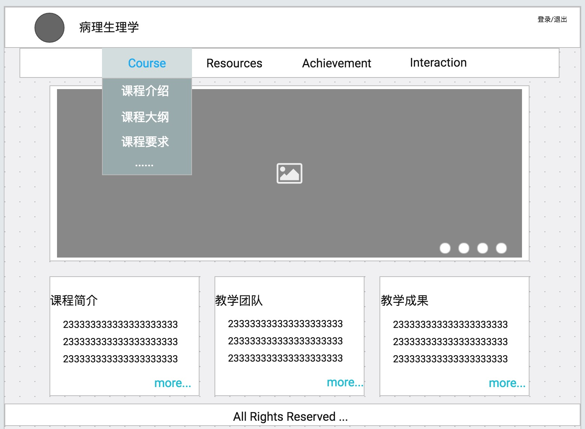
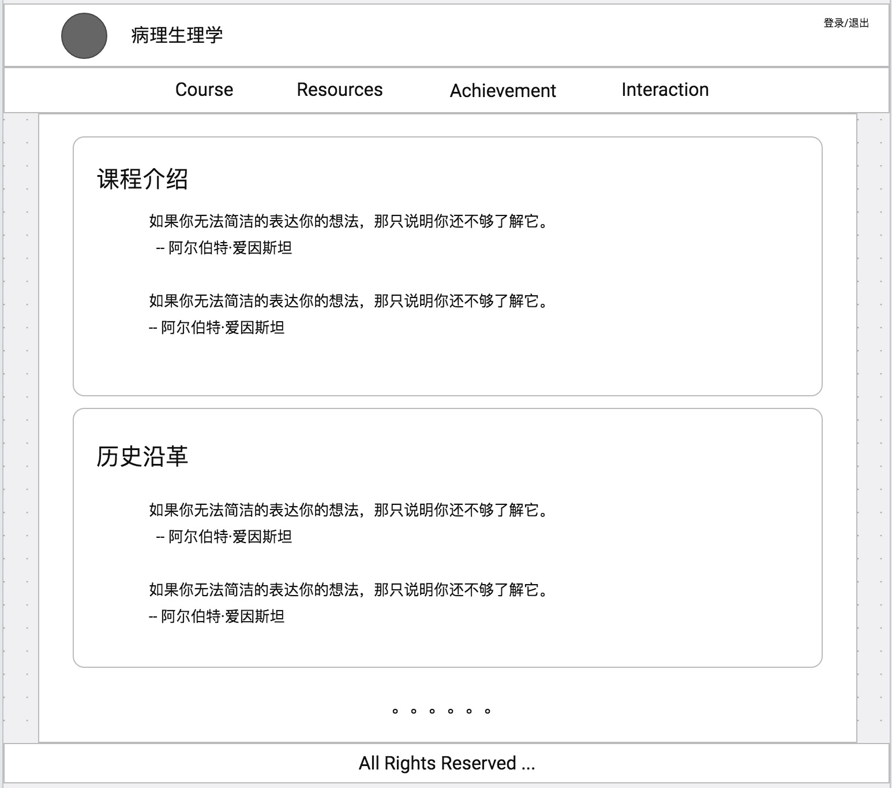
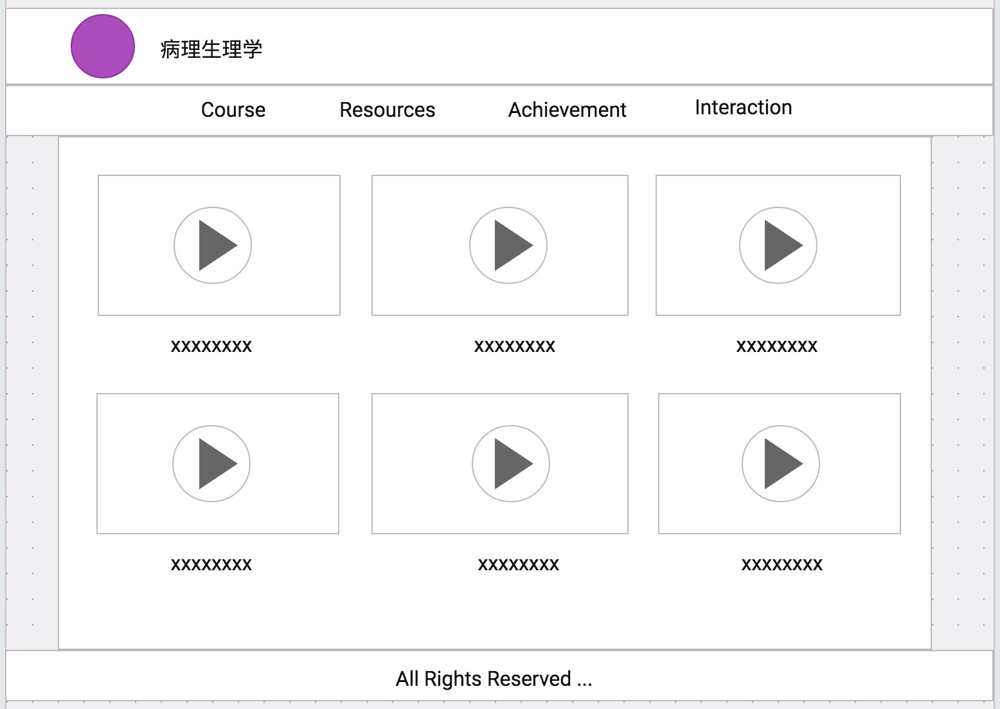
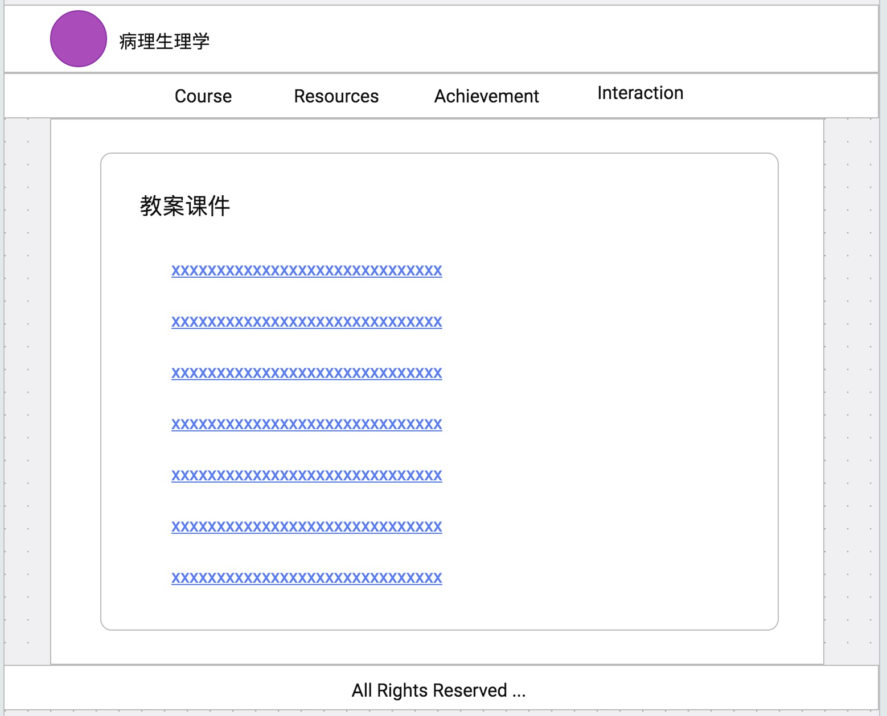
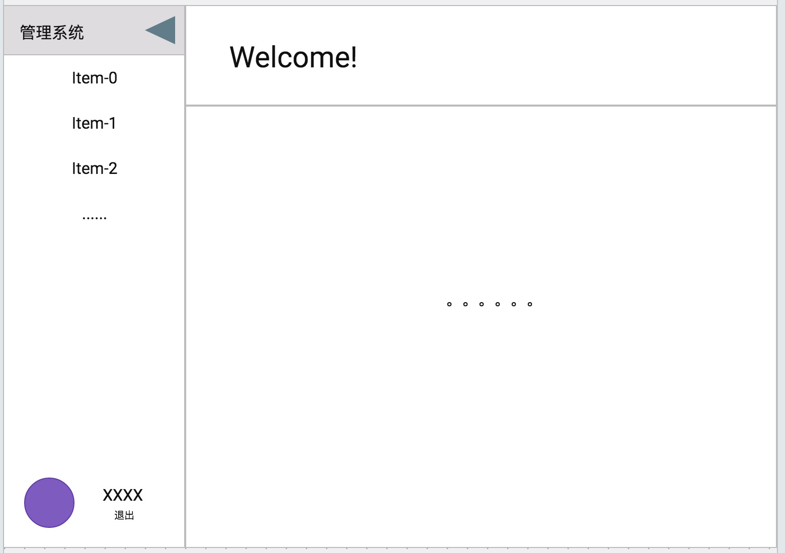
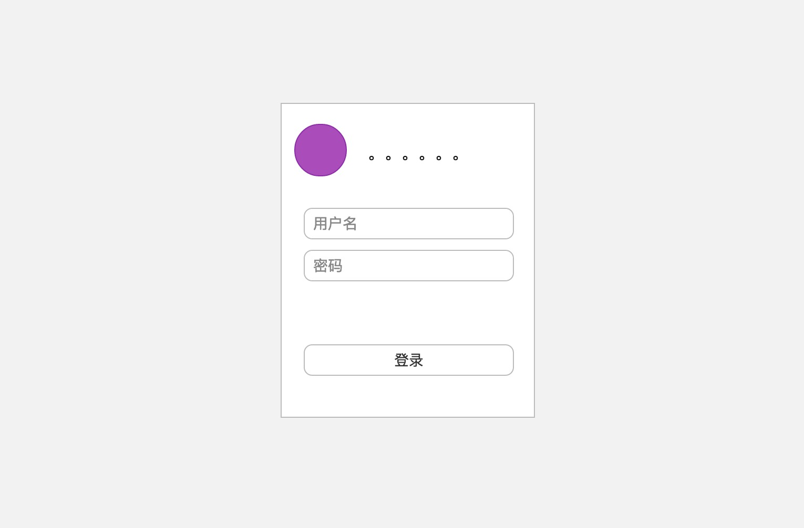

# PCW
> Pathophysiology Course Website. 病理生理学课程网站。

## 1、协作规范
本仓库有2个分支，master和dev。主要在dev分支上进行开发和测试，功能完善之后再合并到master。
```txt
|----master
|----dev
```
#### 1.1、准备工作
在github上fork本仓库到你自己的github，将你自己的远程仓库克隆到本地之后切换分支。
```txt
git clone https://github.com/{你的github}/PCW -b dev
```
#### 1.2、开发过程
要开发某个模块的时候，在你的本地仓库创建一个分支，例如mydev。
```txt
git checkout -b mydev
```
切换之后你的本地仓库上就有3个分支了，如下所示。checkout之后会自动切换到mydev分支。
```txt
|----master
|----dev
|----mydev
```
在mydev分支上进行开发和测试，完成相应的功能或者模块，完成之后再切回到dev分支将mydev的内容合并到dev。
```txt
git checkout dev
```
由于在你开发过程中，我也可能在开发并且更新了仓库，为了避免冲突，在合并分支之前你还需要更新你本地仓库的dev分支。先在本地仓库上添加上游仓库upstream，上游仓库即我的仓库，然后使用pull命令从上游仓库拉取更新。
```txt
git add remote upstream https://github.com/hongchh/PCW dev
git pull upstream
```
更新完dev之后，将mydev分支合并到dev分支并提交到你自己的远程仓库。完成之后，mydev分支就可以删除了，你也可以继续留着。
```txt
git merge mydev
git push origin dev
git branch -d mydev
```
推送到自己的远程仓库后，就可以到github上面给我发起合并请求了，然后等待我合并你的代码。

## 2、网站需求（模块分析）
#### 2.1、Home
1. 图片展示：教研室或者课程特色的图片展览
2. 课程简介：简要介绍课程的历史和内容
3. 教学团队：简要介绍教学团队
4. 教学成就：简要列举近几年的教学成就

#### 2.2、Course
1. 课程介绍：详细的课程介绍，包括历史沿革、课程内容、课程特色
2. 教学大纲：列举课程的教学大纲
3. 教学方法：列举课程教学方法
4. 课程要求：基本要求/教学要求/实验要求/考核评价
5. 课程安排：列举每周的课程安排和实验安排
6. 教学团队：详细介绍教学团队成员的相关信息

#### 2.3、Resources
1. 教学视频：展示教学录像视频，可在线观看也可下载
2. 课件教案：提供教案课件的下载
3. 习题：提供习题的下载或者在线浏览
4. 教材信息：列举教材信息
5. 专业词汇：展示专业词汇中英文对照表

#### 2.4、Achievement
1. 教学荣誉：展示本课程获得的教学荣誉奖项
2. 科研成就：展示教研室科研成果，论文等信息
3. 课程评价：展示同行、学生等第三方对课程的评价

#### 2.5、Interaction
1. 评论：学生可以在此页面发布相关评论、提问或咨询
2. 展示：展示学生评论、提问或咨询；展示教师的回复

#### 2.6、Management
1. 登录管理：所有管理员都需要登录才能对网站进行管理操作；
2. 更新Home：对于Home的课程介绍、教学团队、教学成就这三部分简介的内容进行编辑，修改文本；对首页展示教研室或者课程特色的图片进行更新
3. 更新Course：对Course展示的信息进行修改，包括课程介绍、历史沿革、课程内容、课程特色这4部分信息；对教学大纲进行编辑修改；对教学方法进行编辑修改；对课程要求进行编辑修改；对实验安排进行编辑修改；
4. 更新Resources：添加/删除视频、课件、教案、习题；对教材信息、专业词汇进行编辑修改
5. 更新Achievement：添加/删除荣誉奖项、论文条目、评价信息
6. Interaction：查看/回复学生发布的消息，删除没有意义、无用的消息
7. 账号管理：网站具备1个超级管理员可以添加/删除/重置普通管理员；所有管理员都可以修改自己的登录密码等基本信息
8. student管理：为了防止网站互动区被恶意刷屏，网站提供1个特定的student账号供学生使用，学生需要使用该账号进行登录然后才能互动区发布消息；student的密码由管理员（教师）设定，教师可以每年在授课的时候告诉学生student账号密码供学生使用，不定期地或者在课程结束后修改密码防止student账号泄露；

## 3、用户角色
#### 3.1、普通用户
权限：查看浏览网站内容；下载视频、课件等资源

#### 3.2、学生
权限：在互动区发布消息

#### 3.3、普通管理员
权限：修改更新网站展示内容；修改自己的账号信息；管理student账号

#### 3.4、超级管理员
权限：修改更新网站展示内容；修改自己的账号信息；管理student账号；管理普通管理员账号

## 4、界面原型
#### 4.1、网站首页


**备注：**hover顶部4个项时候弹出菜单，菜单中包含相应模块的各部分内容的链接；主页中间为轮播图，展示教研室以及课程的特色；下面为3个主要的简介，最后的"more"是一个链接，可以跳转到相应的详细介绍的界面；

#### 4.2、主体界面




**备注：**Course、Resources等4部分内容都在主体界面中展示，初步想法为根据不同的URL渲染不同的组件即可，上面是简单的示例。每个组件的UI具体如何，信息如何呈现，需要待开发过程中进一步完善，整体上需要保持风格一致。

#### 4.3、管理界面


**备注：**管理界面的基本结构如上，左边是一个侧拉菜单，根据菜单中不同的选项，在主体界面中展示不同的内容。菜单底部显示管理员的基本信息，以及提供退出的操作；各部分内容具体如何展示待进一步设计。

#### 4.4、登录界面


**备注：**登录界面，管理员或者普通成员都通过此界面登录，然后根据身份跳转到相应的界面。

## 5、数据模型
#### 5.1、轮播图
轮播图使用多张图片，每张图片都有个description对图片进行简要描述，url则是图片的链接。
```json
{
  "description": "string",
  "url": "string"
}
```

#### 5.2、首页的简介
首页的3部分简介分别是3个不同内容的字符串。
```json
{
  "course": "string",
  "team": "string",
  "achievement": "string"
}
```

#### 5.3、课程介绍
课程介绍包括4部分内容，课程介绍/历史沿革/课程内容/课程特色，都是字符串。
```json
{
  "introduction": "string",
  "history": "string",
  "content": "string",
  "feature": "string"
}
```

#### 5.4、教学大纲/教学方法/教学要求
教学大纲/教学方法/教学要求这3部分内容的数据格式都一样，所以合并到一起，加个type字段用于区分。title表示标题，比如教学大纲的章节题目、教学方法的标题等。content可以是对标题进行的简要介绍或者文字描述，例如教学大纲里面某些章节标题下面还会标注重难点，教学方法每个要点后面都有相应的文字介绍。
```json
{
  "type": "string",
  "title": "string",
  "content": "string"
}
```

#### 5.5、教学团队/管理员账号信息
教学团队成员默认也是网站的管理员，所以两者用到是同一份数据。每个成员包括姓名、性别、职称、角色、头像、学历、研究方向这几部分信息，然后还有用于登录的账号密码。职称：教授/副教授/讲师/教员。角色：课程负责人/主讲教师/助理。
```json
{
  "name": "string",
  "sex": "string",
  "title": "string",
  "role": "string",
  "url": "string",
  "education": "string",
  "direction": "string",
  "username": "string",
  "password": "string"
}
```

#### 5.6、课程安排
课程安排即每周的理论课或者实验课的安排，用type字段区分理论课和实验课，week表示第几周，content表示对应那周的上课内容。
```json
{
  "week": "number",
  "type": "string",
  "content": "string"
}
```

#### 5.7、视频、课件、习题等资源
视频、课件资源则是提供1个url用于下载即可，另外需要用type字段区分类型，name字段对响应的资源进行简要描述。
```json
{
  "type": "string",
  "name": "string",
  "url": "string"
}
```

#### 5.8、教材信息
教材分为现用教材/主编教材/主审教材/参考教材这几种类型，用type字段区分，description则描述教材名称、作者、出版社、年份等信息。
```json
{
  "type": "string",
  "description": "string"
}
```

#### 5.9、荣誉和评价
荣誉和评价基本都是图片，所以只需要提供url下载到浏览器展示即可。description对图片进行简要描述，type则是区分类型（荣誉/评价）。
```json
{
  "type": "string",
  "description": "string",
  "url": "string"
}
```

#### 5.10、论文
论文分为教学论文/科研论文两部分，用type字段区分。name为论文名称，time为发布时间，author为论文作者，publication为收录论文的刊物。
```json
{
  "type": "string",
  "name": "string",
  "time": "string",
  "author": "string",
  "publication": "string"
}
```

#### 5.11、互动
互动区发布的消息内容存在content字段，time描述发布的时间，例如：2017-02-01 21:58。comment则是一个数组，里面收集其他用户对评论的回复，包括回复者、回复时间、回复内容3部分信息。
```json
{
  "content": "string",
  "time": "string",
  "comment": [{
    "content": "string",
    "user": "string",
    "time": "string"
  }]
}
```

#### 5.12、student账号
student账号比较简单，只有用于登录的账号密码以及头像的url。
```json
{
  "username": "string",
  "password": "string",
  "url": "string"
}
```