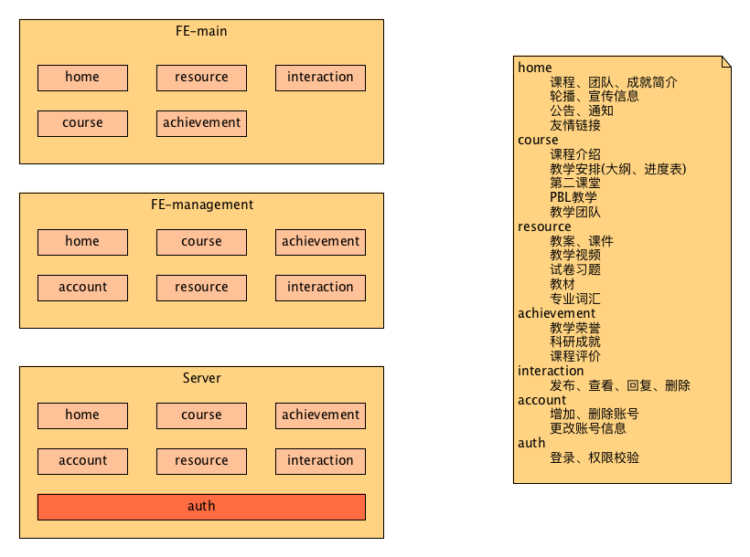

# PCW
> Pathophysiology Course Website. 中山大学病理生理学课程网站。（静态网站版本）

```bash
# 项目启动和构建相关介绍
# 开发，http://localhost:8080/main.html
npm run dev
# 构建前端产品文件
npm run build
# 运行服务器，在启动服务器需要确保先构建好前端的产品文件
# http://localhost:8080/pathophysiology/main.html
npm run server
# 代码风格规范检测
npm run lint-fe
npm run lint-server
```

## 项目结构
```txt
├─FrontEnd: 课程网站前端代码
│    ├─build: 存放webpack开发和构建相关配置文件
│    ├─config: 存放webpack配置文件
│    ├─static: 项目开发过程中需要用到的伪数据以及图片等静态资源
│    │   ├─data: 伪数据json文件
│    │   └─img: 图片文件
│    └─src: 源代码
│        ├─common: 各子项目引用的公共资源
│        ├─main: 主站代码
│        │    ├─assets: 网站中引用的字体、图标等静态资源
│        │    ├─components: 页面组件
│        │    │    ├─achievement: 科研、教学成就模块
│        │    │    ├─course: 课程模块
│        │    │    ├─home: 网站首页以及公告模块
│        │    │    ├─interaction: 互动模块（本目录涉及的需求已废弃，无需关注）
│        │    │    └─resource: 课程资源模块
│        │    ├─router: 前端路由配置
│        │    ├─App.vue: 应用最外层结构
│        │    ├─index.html: 应用的html网页入口
│        │    └─index.js: 应用的js模块入口
│        ├─management: 管理系统代码（本目录涉及的需求已废弃，无需关注）
│        │    ├─assets: 网站中引用的字体、图标等静态资源
│        │    ├─components: 页面组件
│        │    │    ├─account: 账号管理模块
│        │    │    ├─achievement: 科研、教学成就管理模块
│        │    │    ├─course: 课程信息管理模块
│        │    │    ├─home: 网站首页信息管理模块
│        │    │    ├─interaction: 互动信息管理模块
│        │    │    └─resource: 课程资源管理模块
│        │    ├─router: 前端路由配置
│        │    ├─store: 管理系统vuex数据状态管理
│        │    ├─App.vue: 应用最外层结构
│        │    ├─index.html: 应用的html网页入口
│        │    └─index.js: 应用的js模块入口
│        └─signin: 登录页面（本目录涉及的需求已废弃，无需关注）
│             ├─assets: 背景图和logo
│             ├─App.vue: 登录界面
│             ├─index.html: 登录页面html入口
│             └─index.js: 登录页面js入口
├─images-for-readme: 存放README用到的图片文件
├─Server: 服务端代码
│    ├─pathophysiology: 前端静态资源以及页面文件
│    │    ├─static: 前端静态资源
│    │    └─main.html: 主站入口页面
│    └─index.js: express服务器配置和启动文件
├─.babelrc: babel配置文件
├─.editorconfig: 编辑器配置文件
├─.eslintignore: eslint配置文件
├─.eslintrc.js: eslint配置文件
├─.gitignore: git配置文件
├─package.json: 项目包管理文件
└─README.md: 项目描述和部分文档
```

## 1、协作规范
本仓库有2个分支，master和dev。主要在dev分支上进行开发和测试，功能完善之后再合并到master。
```txt
├─master
└─dev
```
#### 1.1、准备工作
在github上fork本仓库到你自己的github，将你自己的远程仓库克隆到本地之后切换分支。
```bash
git clone https://github.com/{你的github}/PCW
# 上游的源仓库地址只需添加一次
git remote add upstream https://github.com/hongchh/PCW
# 切出 dev 分支
git checkout -b dev
# 拉取 dev 分支的最新内容
git pull upstream dev
```

#### 1.2、开发过程
可以直接在你本地仓库的dev分支上面进行开发，然后在发送PR之前先从源仓库拉取更新。
```bash
# 切换到 dev 分支
git checkout dev
# 进行开发，开发完某个功能后提交你的代码
git add -A
git commit -m "add something"
# 拉取上游的源仓库 dev 分支上的更新，可能会有冲突需要自行解决
git pull upstream dev
# 推送到你自己的远程仓库，注意这里是 push 到 origin dev，不是 upstream dev
git push origin dev
```

## 2、开发规范
1. Vue组件文件名使用首字母大写驼峰形式命名，例如"CourseIntroduction.vue"；name属性采取小写形式，例如"course-introduction"。
2. 普通文件夹采用小写短线形式命名，例如"images-for-readme"；项目文件夹采取首字母大写的形式命名，例如"Server"。
3. 代码缩进为2个空格；语句末尾全部不写分号；其他代码风格细节参考eslint的提示进行修改。
4. 使用pug+sass+es6进行开发。
5. 各个界面在路由中已经引入并写好跳转关系，如果界面中需要用到自定义组件请将组件放置在该界面所在的文件夹里面。例如管理系统首页把轮播图的配置单独写成1个组件Carousel.vue，那么就要将轮播图组件放在/home文件夹里面表示该组件属于home模块，如果涉及到比较多自定义子组件可以在所属模块的文件夹下面继续建立子文件夹。main模块基本已经解耦可以单独进行各个子模块的开发，所以全程需要保持顶层的关系不变避免冲突。
6. 伪数据生成器和伪数据json文件都放置在data文件夹下面。生成器和json文件的命名格式为"xxx-genertor.js"和"xxx.json"，其实"xxx"为上述各个数据模型的英文名称。
7. 编辑器配置参考.editorconfig。
8. 所有开发过程中使用的“可变”的需要异步获取的静态资源放于data文件夹下，例如轮播图。“固定”的无需异步获取静态资源放于相应项目的assets文件夹下，例如网站顶栏logo。

## 3、网站需求（模块分析）
**重要：由于资源配置原因，只能启用静态网站版本。师生互动、管理系统以及服务端支持等需求全部砍掉。网站内容的更新暂时只能通过更新相应的JSON文件来实现。**

#### 3.1、home
1. 科室风采：教研室或者课程特色的图片轮播展示（主站）；更新图片 ~~（管理系统）~~
2. 概要信息：简要介绍课程、团队、成就，附带图片（主站）；更新信息和图片 ~~（管理系统）~~
3. 公告：教研室发布最新公告（主站）；发布或删除公告 ~~（管理系统）~~
4. 友情链接：跳转到医学院主页、实验室平台等其他网站（主站）；更新友情链接 ~~（管理系统）~~

#### 3.2、course
1. 课程介绍：详细的课程介绍，包括历史沿革、教学方法、五年目标等内容（主站）；对课程介绍内容进行更新 ~~（管理系统）~~
2. 第二课堂：展示课后辅导、学生综述等第二课堂相关照片；替换、增加或删除展示照片、编辑照片信息 ~~（管理系统）~~
3. 课程安排：提供课程安排计划表下载（主站）；更新课程安排计划表 ~~（管理系统）~~
4. 教学团队：详细介绍教学团队成员的相关信息（主站）；更新团队信息
5. PBL教学：提供PBL教学相关照片的展示（主站）；更新PBL教学相关资料 ~~（管理系统）~~

#### 3.3、resources
1. 教学视频：展示教学录像视频，可在线观看也可下载（主站）；替换、增加或删除教学视频 ~~（管理系统）~~
2. 课件教案：提供教案课件的下载（主站）；替换、增加或删除教案课件 ~~（管理系统）~~
3. 习题：提供习题的下载或者在线浏览（主站）；替换、增加或删除习题 ~~（管理系统）~~
4. 教材信息：列举教材信息（主站）；更新教材信息 ~~（管理系统）~~
5. 专业词汇：展示专业词汇中英文对照表（主站）；更新专业词汇表 ~~（管理系统）~~

#### 3.4、achievement
1. 教学荣誉：展示本课程获得的教学荣誉或比赛奖项（主站）；更新教学荣誉相关资料 ~~（管理系统）~~
2. 科研成就：展示教研室科研成果，论文等信息（主站）；更新科研成就相关资料 ~~（管理系统）~~
3. 课程评价：展示同行、学生等第三方对课程的评价（主站）；更新课程评价相关资料 ~~（管理系统）~~

#### ~~3.5、interaction~~
1. ~~评论：学生或教师可以在此页面发布讨论帖，回复讨论帖（主站）~~
2. ~~展示：展示学生或教师的讨论帖以及相关回复评论（主站）~~
3. ~~评论管理：删除某篇讨论贴、删除某条评论回复、批量删除讨论帖或回复（管理系统）~~

#### ~~3.6、account~~
1. ~~学生账号管理：更新修改学生账号密码（管理系统）~~
2. ~~教师账号管理：普通教师用户更新教师个人信息（管理系统）~~
3. ~~超级管理员：管理网站所有账号，包括教师和学生账号，新增、删除某个账号，修改某个账号信息（管理系统）~~

## 4、用户角色
#### 4.1、普通用户
权限：查看浏览网站内容；下载视频、课件等资源

#### ~~4.2、学生~~
~~权限：查看浏览网站内容；下载视频、课件等资源；在互动区发布消息~~

#### ~~4.3、普通管理员~~
~~权限：查看浏览网站内容；下载视频、课件等资源；在互动区发布消息；修改更新网站展示内容；修改自己的账号信息；管理student账号~~

#### ~~4.4、超级管理员~~
~~权限：查看浏览网站内容；下载视频、课件等资源；在互动区发布消息；修改更新网站展示内容；修改自己的账号信息；管理student账号；管理普通管理员账号~~

## ~~5、整体架构~~

